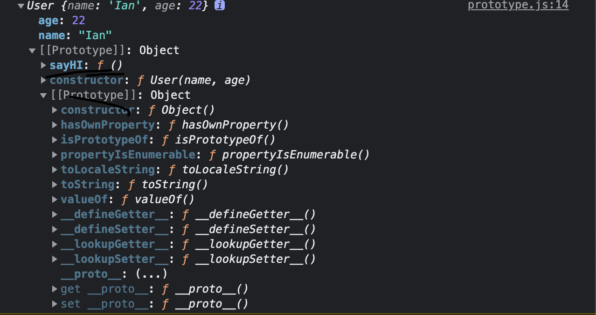
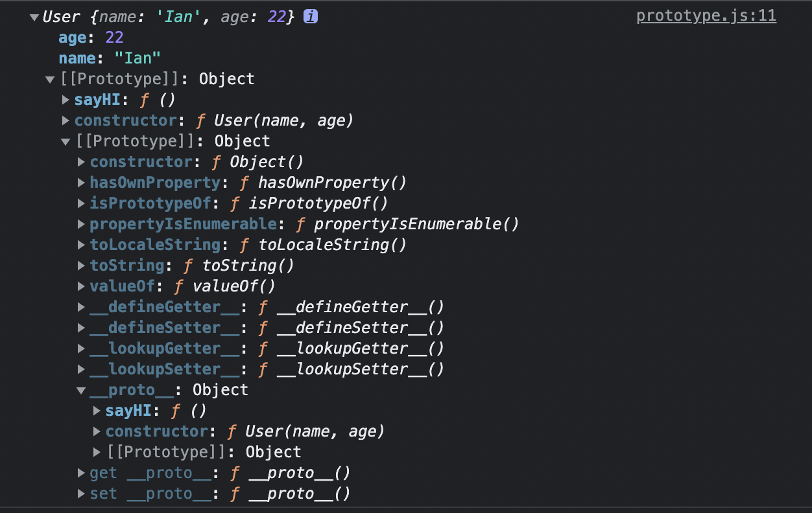
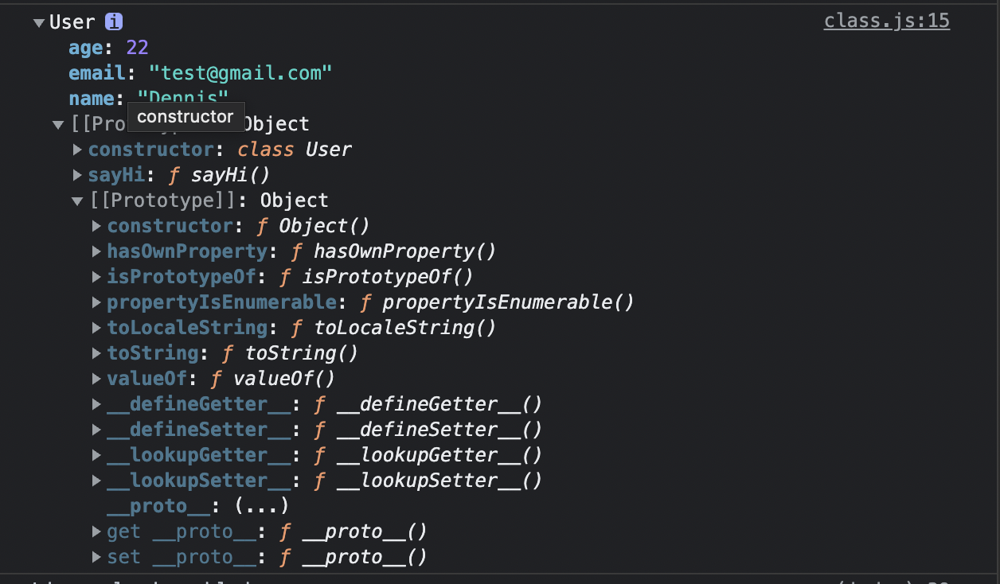

# JavaScript-Note
首先很感謝大家觀看我筆記,如果有什麼需要修正的請issue給我

或是 `Email` : `ococo09000@gmail.com`


## Table of Contents

* [Declaration](#Declaration)
* [Variables](#Variables)
* [Data Type](#Data-Type)
* [Arrow function](#Arrow-function)
* [Operator](#Operator)
* [Comparation](#Comparation)
* [Conditional](#Conditional)
* [String methods](#String-methods)
* [Array methods](#Array-methods)
* [Object methods](#Object-methods)
* [Date](#Date)
* [Destructing](#Destructing)
* [Scope Chain](#Scope-Chain)
* [Closure](#Closure)
* [Callback](#Callback)
* [Asychronous](#Asynchronous)
* [Prototype](#Prototype)
* [Class](#Class)
* [Import/Export](#Import--Export)


## Declaration
變數(variable),我們可以稱為儲存資料的盒子

而變數需要被宣告(declare)並且告知編譯器

* 宣告方法
    * var
    * let
    * const

宣告temp變數
```javascript
var temp
```
賦予其數值
```javascript
var temp = "hello world!!!"
```
> JavaScript中我們不需要定義變數的資料型態(ex: string...)

---

[⬆️ Back to Contents](#Table-of-Contents)

## Variables
* var
* let
* const

### var 
> var為JavaScript(ES6)之前唯一的宣告方法

* 可重複宣告
* 可先宣告不給予初始值
* 全域變數

```javascript
var temp

var temp = 10

var temp = 100
console.log(temp) //100
```

### let 
let為JavaScript(ES6)版本新增的變數宣告方法

考量到var會污染到全域變數和造成開發者重複定義變數之情形

現在基本上使用let為嚴謹宣告方法
* 區塊變數(block scope)
* 不可重複宣告
* 可宣告不給予初始值

var造成開發問題

```javascript
var text = "Hello world";
var text = "What";
```

```javascript
let text;
let text;
//SyntaxError: Identifier 'text' has already been declared
```

### const
* 不可重複宣告
* 不可修改數值(read only)
* 不可宣告而不給予數值

未給予初始值
```javascript
const text;
//SyntaxError: Missing initializer in const declaration
```

重複宣告其變數
```javascript
const text = '1';
const text = '1';
//SyntaxError: Identifier 'text' has already been declared
```
更改其數值
```javascript
const text = '1';
text = '2';
//TypeError: Assignment to constant variable.
```

以下sum方法我們不會再更改其宣告內容

這時候確保sum是唯獨(read only)可保持開發流程的品質
```javascript
const sum = (a,b) => {
    return a + b
}
```

更改陣列內容 為[5,7,3]
```javascript
const array = [2,5,7]
array = [5,7,3] //error
```
可以發現array被const定義唯獨

我們可以使用更改index值
```javascript
array[0] = 5
array[1] = 7
array[2] = 3
```
---

[⬆️ Back to Contents](#Table-of-Contents)

## Data Type
* Call by value
    * string
    * number
    * undefined
    * null
    * NaN
* Call by reference
    * array
    * object
    * function

### String
```javascript
var text = String("Hello World")

var text = "Hello World"
```
#### Single quotes
```javascript
var text = 'Hello World'
```
#### Double quotes
```javascript
var text = "Hello World"
```

#### Escapes

|syntax| output|
|---| --- |
| `\'` |	single quote|
| `\"` |	double quote|
| `\\` |	backslash|
| `\n` |	newline|
| `\r` |	carriage return|
| `\t `|	tab|
| `\b` |	word boundary|
| `\f` |	form feed|


錯誤示範
```javascript
var text = "Hello world "I am Ian""
```

使用跳脫字元 `\" `  +  `\"`
```javascript
var text = "Hello world \"I am Ian\"."
```

---

### Number
```javascript
var price = Number(100)

var price = 100
```

---

### Undefined
    未被賦值之變數
```javascript
var value
console.log(value) //undefined
```

---

### Null
    與undefined差別在於, JavaScrip中變數未給初始值會被賦值undefined

    null類似直接宣告其為空值,類似暫時取代其它值的替代方案

---

### NaN
    NaN(Not a Number),通常非數值而做運算時,即被賦值NaN
```javascript
var value = "我是中文"
const result = value / 100
console.log(result);// NaN
```

---

### Array
```javascript
var temp = Array(1,2,3)

var temp = [1,2,3]
```

### Object
* `property : value`
```javascript
var user = Object({name: "Ian", age: 22})

var user = {
    name: "Ian",
    age: 22
}

```
取得屬性
```javascript
var user = {
    name: "Ian",
    age: 22
}

const result = user["name"]
console.log(result)//Ian
```


新增屬性

```javascript
user.email = "test@gmail.com"

user["email"] = "test@gmail.com"
```


---
[⬆️ Back to Contents](#Table-of-Contents)

### Function
* declaration function
* expression function
* anonymous expression function
* arrow function (ES6)
* keyWord `return`

```javascript
//declare
function sum(a,b) {
    return a + b
}
//expression
const sum = function sum(a,b) {
    return a + b
}
//anonymous expression
const sum = function(a,b) {
    return a + b
}

// arrow function
const sum = (a,b) => a + b

const sun = (a,b) => {
    return a + b
}
```

#### Return
```javascript
const sum = (a,b) => {
    console.log(a+b)
}
const value = sum(2,2) //print 4
//value equal function


const sum = (a,b) =>  {
    retunr a+b
}

const value = sum(2,2) //4
//value eauql 4
//and 
const result = value * value
console.log(result) //16
```

#### Parameter

```javascript
function shallow(n1,n2,n3) {
    const mix = [n1,n2,n3]
    console.log(mix);
}

shallow(20,30,40)
```
* shallow好處
    * 過多、參數傳遞問題
    * 更簡短語法

```javascript
function shallowCP(...args) {
    console.log(args);//[ 20, 30, 40 ]
    console.log(args.forEach((item) => console.log(item)))
    //20
    //30
    //40
}
shallowCP(20,30,40)
```
---

[⬆️ Back to Contents](#Table-of-Contents)

## Arrow function

不帶參數之函式
```javascript
function sayHello() {
    console.log("hello");
}
const sayHello_Two = () => {
    console.log("hello");
}

sayHello()
sayHello_Two()
```

而如果函式只有一行,可以把大括號省略

```javascript
const sayHello_Two = () => console.log("hello")
```

帶參數的arrow function

```javascript
const sayHello_Two = (a,b) => a + b
const value = sayHello_Two(2,4)
console.log(value)//6
```

```javascript
let user = {
    name: "Ian",
    say: function() {
        console.log(this.name);
    },
    sayArr: () => console.log(this.name)
}

user.say() //Ian
user.sayArr() //undefined
```


```javascript
class User {
    constructor(name) {
        this.name = name
    }
    
    sayHiFunction() {
        console.log(this)
    }
    sayHiArrow = () => console.log(this);
}

let user = new User("Dennis")
user.sayHiArrow()// class User
user.sayHiFunction()//class User
```


---

[⬆️ Back to Contents](#Table-of-Contents)

## Operator
運算子在程式語言中(不限任何語言)都是十分重要

打好基本功,會讓後面學習更得心應手


`++`

```javascript
let number = 10
number++
console.log(number);//11
```
`--`

```javascript
let number = 10
number--
console.log(number);
```

`reference ++`
```javascript
let temp = 10;
let value = temp++;
console.log(value,temp); //10 11
//先給予參考本身再遞增數值
```

`reference --`
```javascript
let temp = 10;
let value = temp--;
console.log(value,temp);10 9
//先給予參考本身在遞減數值
```

那我們要怎麼依照原來的寫法正確傳遞呢？

```javascript
let temp = 10;
let value = ++temp;
// or
let value += temp;
console.log(value,temp);//11 11
//把運算子放在前方,算好數值變數value才取得參考
```

這邊的觀念其實也是JavaScript本身運作的原理,

JavaScript傳遞以下類型資料時,都是淺參考(shallow reference)

也就是只傳遞數值,與Array, Object的原理不同

* Number
* String
* Undefined
* Null
* NaN

```javascript
let number = 2
console.log(number * number);    //4
console.log(number ** number);   //4
console.log(number / number);    //1
console.log(number % number);    //0
```

---

[⬆️ Back to Contents](#Table-of-Contents)

## Comparation


| syntax | expression | ouput |
| -------- | -------- | -------       | 
| ==    | 1 == "1"      | true| 
| ===   | 1 === "1"     |false|
| \| \|  | result = 1 \|\| 2| 1|
| &&    | result = 1 && 2| 2|
| !=     | 1 != "1"        | false |
| !==    | 1 !== "1"      | true |
| >=| 1 >= "1"| true|
| <=| 1 <= "1" | false|
* Equal
    * `==` 
        使用` ==`  (自動轉型,不嚴謹的比對)
        ```javascript
        let str = "12"
        console.log(str == 12) //true
        ```
    * `===`

        使用`===` (嚴謹比對資料型態)
        ```javascript
        let str = "12"
        console.log(str === 12)// false
        ```

* Or
    ```javascript
    const result = false || true
    console.log(result)//true

    const result = true || false
    console.log(result)// true
    ```

* And
    * `&`
        自動轉型
        ```javascript
        const result = true & false
        console.log(result)//0
        const result = false & true
        console.log(result)//0
        const result = true & true
        console.log(result)//1
        ```

    * `&&`

        嚴格比對
        ```javascript
        const result = true && false
        console.log(result);//false

        const result = false && true
        console.log(result)//false

        const result = true && true
        console.log(result)//true
        ```
* Not Equal

    * `!=`
    ```javascript
    const result = 1 != "1"
    console.log(result)//false
    ```
    * `!==`
    ```javascipt
    const result = 1 !== "1"
    console.log(result)//true
    ```
---

[⬆️ Back to Contents](#Table-of-Contents)

## Conditional

* `if` 、 `else if` 、`else`
* `switch` 

`if`

```javascript
function compare(value) {
    if(value > 6) {
        return `over the ${value}` 
    } else {
        return `under the ${value}`
    }
}
```

`switch`

```javascript
function compare(value) {
    switch(value) {
        case "1":
            return 1

        default:
            return -1
    } 
}
```
---

[⬆️ Back to Contents](#Table-of-Contents)

## String methods
* slice(start, end)
* substring(start, end)
* substr(start, length)
* replace

### slice
```javascript
var text = "Hello world"
console.log(text.slice(0,3)) //Hel
```
### substring
```javascript
var text = "Hello world"
console.log(text.substring(3,8)) //lo wo
```
### substr
```javascript
var text = "Hello world"
console.log(text.substr(3,4)) //lo wo
```
### replace
```javascript
var text = "台灣新北市中和區"
var concat = text.replace("台灣", "中華民國")
console.log(concat);// 中華民國新北市中和區
```
### toLowerCase
```javascript
var text = "Hello World"
console.log(text.toLowerCase()) //hello world
```
### toUpperCase
```javascript
var text = "Hello World"
console.log(text.toUpperCase()) //HELLO WORLD
```
### split
```javascript
var text = "Hello%World"
console.log(text.split('%')) //[ 'Hello', 'World' ]
```

---

## String search
* indexOf


### indexOf
```javascript
var text = "Hello World"
console.log(text.indexOf('o')) //4
```

----

[⬆️ Back to Contents](#Table-of-Contents)

## Array methods
* toString
* pop
* push
* shift
* unshift
* filter
* map
* length
* concat
* splice
* slice
* every
* some
* foreach

### toString
```javascript
 var temp = [1,2,3,4,5,6,7,8]
console.log(temp.toString())//1,2,3,4,5,6,7,8
```

### concat
```javascript
var a = [1,2,3,4,5,6,7,8]
var b = [10,12]
console.log(a.concat(b))
//[1, 2, 3,  4, 5, 6, 7, 8, 10, 12]
```

### length
```javascript
var a = [1,2,3,4,5,6,7,8]
console.log(a.length)//8
```

### pop
```javascript
var a = [1,2,3,4,5,6,7,8]
a.pop()
console.log(a)
/*
[
  1, 2, 3, 4,
  5, 6, 7
]
*/
```

### push
```javascript
var a = [1,2,3,4,5,6,7,8]
a.push(9)
console.log(a)
/*
[
  1, 2, 3, 4,
  5, 6, 7, 8 , 9
]
*/
```

### shift
```javascript
var a = [1,2,3,4,5,6,7,8]
a.shift()
console.log(a)
/*
[
  2, 3, 4, 5,
  6, 7, 8
]
*/
```

### unshift
```javascript
var a = [1,2,3,4,5,6,7,8]
a.unshift(9)
console.log(a)
/*
[
  9, 1, 2, 3, 4,
  5, 6, 7, 8
]
*/
```

### map
```javascript
var a = [1,2,3,4,5,6,7,8]
console.log(a.map(function(item) {
    return item * 2
}));
/*[
   2,  4,  6,  8,
  10, 12, 14, 16
]
*/
```

### filter
```javascript
var a = [1,2,3,4,5,6,7,8]
console.log(a.filter(function(item) {
    return item > 2
}));
//[ 3, 4, 5, 6, 7, 8 ]
```

### some
```javascript
var a = [1,2,3,4,5,6,7,8]
console.log(a.some(function(item) {
    return item > 2
}));
//true
```

### every
```javascript
var a = [1,2,3,4,5,6,7,8]
console.log(a.every(function(item) {
    return item > 2
}));
//false
```

### forEach
```javascript
var a = [1,2,3,4,5,6,7,8]
console.log(a.forEach(function(item) {
    console.log(item);  
}));
/*
1
2
3
4
5
6
7
8
*/
```

---

[⬆️ Back to Contents](#Table-of-Contents)

## Object methods
* hasOwnProperty
* freeze

### freeze
freeze可以達成const的唯獨效果,避免物件被更改屬性值
```javascript
function freezeObj() {
  const MATH_CONSTANTS = {
    PI: 3.14
  };
  // Only change code below this line
  Object.freeze(MATH_CONSTANTS)

  // Only change code above this line
  try {
    MATH_CONSTANTS.PI = 99;
  } catch(ex) {
    console.log(ex);
  }
  return MATH_CONSTANTS.PI;
}
const PI = freezeObj();//3.14
```


### hasOwnProperty
```javascript
const user = {
    name: "Ian",
    age: 22
}
const checkResult = user.hasOwnProperty("name")
console.log(checkResult) //true
```

---

[⬆️ Back to Contents](#Table-of-Contents)

## Date

---

[⬆️ Back to Contents](#Table-of-Contents)

## Destructing
我們先了解JavaScript使用array或是object都是call by reference

### object
```javascript
const user = {
    name: 'Ian',
    age: 22
}
const {name, age} = user
console.log(name, age); //Ian 22
```

rename the parameter
```javascript
const user = {
    name: 'Ian',
    age: 22
}
const {age: user_age} = user
console.log(user_age)//22
```
### nested object
```javascript
const user = {
    about: {
        email: "test@gmail.com",
        link: "a"
    },
    age: "22"
}
const { about: { email: user_email }} = user 
console.log(user_email);//test@gmail.com
```

### array
```javascript
const array = [1,2,3]
const [a,b,c] = array
console.log(a,b,c); //1, 2, 3
```
解構過少
```javascript
const array = [1,2,3]
const [a,b] = array
console.log(a,b); //1, 2
```

解構過多
```javascript
const array = [1,2,3]
const [a,b,c,d] = array
console.log(a,b,c,d); //1, 2, 3 undefined
```


React中取用useState也是使用此方法
```jsx=
const [user, setUser] = useState(initialize)
```
### nested array
```javascript
const array = [["dog","cat"], ["Apple", "banana"]]
const value = array[0[1]]
console.log(value)//cat
```
### function 
```javascript
const user = {
    name: "Ian",
    age: 22
}

function test({name, age}) {
    console.log(name,age)
}
test(user)//Ian 22
```

### swap
```javascript
const arr = [1,2,3]
const [a,b,c] = arr
[a,c,b] = [a,b,c]
console.log(a,b,c)//1,3,2
```
### shallow copy 
也就是當我執行以下操作,兩個參數牽一髮而動全身
```javascript
const arr1 = [1,2,3]
const arr2 = arr1;
arr2.push(100)
console.log(arr1,arr2)//[1,2,3,100][1,2,3,100] 
```
但我只是想複製一份來做額外的操作

我們可以使用`...`來取得數值,也可以稱為shallow copy

```javascript
const arr1 = [1,2,3]
const arr2 = [...arr1];
arr2.push(100)
console.log(arr1,arr2);//[ 1, 2, 3 ] [ 1, 2, 3, 100 ]
```

function parameter
```javascript
function shallow(n1,n2,n3) {
    const mix = [n1,n2,n3]
    console.log(mix);
}

shallow(20,30,40)//[ 20, 30, 40 ]

function shallowCP(...args) {
    console.log(args);//[ 20, 30, 40 ]
    console.log(args.forEach((item) => console.log(item)))
    //20
    //30
    //40
}
shallowCP(20,30,40)
```

---

[⬆️ Back to Contents](#Table-of-Contents)

## Scope Chain
Scope其實就是定義一個區塊,只能內層存取,也可以稱為最小暴露原則
* 優勢
    * 減少命名衝突
    * 達到暴露最少原則
    * 避免污染全域變數
* 區塊範圍
    * `function scope`
    * `block scope`
    * `global`
* scope chain
    * 呼叫之變數、函式在哪個作用域

`函式管理`

```javascript
function scope() {
    let str = "Hello world!";
    console.log(str);
}

scope()// Hello World
console.log(str)// undefined
```


`模組化管理`

```javascript
let sayModule = {
    sayHello: function(str) {console.log(str)} ,
    sayGoodbye: function(str) {console.log(str)}
}
sayModule.sayHello(1)
```

`迴圈`
```javascript
console.log(`globla a: ${a}`);//undefined
for(var a = 0; a < 10; a++) {
    setTimeout(() => {
        console.log(a)
        //10
        //10
        //10...
    },2000)
}
console.log(a); //10
```

我們可以發現其實迴圈並沒有自己的block

導致a直接污染global,最後非同步函式只會抓到最後stack(堆疊好的)
`var a = 10 a < 10 `再依序執行就是每次都抓到10的數值

而解法我們可以使用
* `let`
* `IIFE(Immediately invoked function expression)`

```javascript
for(let a = 0; a < 10; a++) {
    setTimeout(() => {
        console.log(a);
    },1000)
    //1
    //2
    //3...
}
```

最後我們要來解釋 `scope chain`

* `呼叫之變數、函式在哪個作用域`

```javascript
var name = "Ian"
a()//Ian

function a() {
    var name = "Dennis"
    b()
}
function b() {
    console.log(name)
}
```

我們可以發現因為function b被定義在global,於是自然而然無論在何處呼叫,取得的變數都是global name


---

[⬆️ Back to Contents](#Table-of-Contents)

## Closure
其實專有名稱只是在形容特定使用情形,而我就是常常把scope chain中的function scope和closure搞混

* clsure
    * 使用指向另一個function之方式傳遞
    * 避免被垃圾回收機制回收,達到繼續存取指向變數
    * 最小曝露原則

先來看scope chain的原理

scope chain是指`語彙範疇`
```javascript
let name = "Ian" //Ian
a()
function a() {
    let name = "Dennis"
    b()
}
function b() {
    console.log(name);
}
```

而`closure`是存取指向之變數
```javascript
function a() {
    let count = 0
    return function b() {
        count++;
        console.log(count);
        return count
    }
}

const result = a()
result()//1
result()//2
```

就這樣？？？

沒錯的 很多專有名詞只是看起來“很難”而已！！！


---

[⬆️ Back to Contents](#Table-of-Contents)

## Callback
由於JavaScript是使用者響應語言

常常實作時,我們需要監聽使用者是否點擊按鈕

而點擊按鈕響應的事件就是使用callback執行
* 回調之參數
* 解決step by step

```javascript
function buttonEvent(callback) {
    callback()
}
```

下列的示範我們可以更了解

我要先執行
1. wash hands
2. eat dinner
3. studying

```javascript
function todo(callback) {
    console.log("studying")
    callback
}

function eat(callback) {
    console.log("eat dinner")
    callback
}

function study() {
    console.log("wash hands")
}

todo(eat(study()))
/*
studying
eat dinner
wash hands
*/
```

如何使用callback取得資料

```javascript
function buttonEvent(callback) {
    let result = 2
    callback(result)
}


const getData = (data) => {
    let value = data
    console.log("value is: " + value );
}

buttonEvent(getData)
```

我們來小實踐平常一些 API 的 callback

我們要來寫個自己開發的小功能
* data接受三個參數 (number, array , callback)
* callback可以取得完成後的陣列,跟原始陣列

```javascript
function data(num, arr, callback) {
    let copyArr = [...arr]
    arr.push(num)
    callback(arr, copyArr)
} 

function getData(data, oldData) {
    console.log(`data: ${data}, the oldData ${oldData}`);
}
let number = 100
let array = [1,2,3]
data(number, array, getData)
//data: 1,2,3,100 , the oldData: 1,2,3
```

如果我們只想取得最新的陣列就好,原始陣列不需要取得

也就是callback只需要一個參數取得即可

```javascript
function data(num, arr, callback) {
    let result = [...arr]//shallow copy array
    arr.push(num)
    callback(result, arr)
} 

function getData(data) {
    console.log(`data: ${data}`);
}
let number = 100
let array = [1,2,3]
data(number, array, getData)
// data: 1,2,3
```

---

[⬆️ Back to Contents](#Table-of-Contents)

## Asynchronous
* Callback
* Promise(ES6)
* Async / Await


### Callback
1. wash hands
2. eat dinner
3. studying

```javascript
function todo(callback) {
    console.log("studying")
    callback
}

function eat(callback) {
    console.log("eat dinner")
    callback
}

function study() {
    console.log("wash hands")
}

todo(eat(study()))
/*
studying
eat dinner
wash hands
*/
```

### Promise
* `ES6新增之語法`
* `callback(resolve, reject)`
* `status`
    * `pendding`
    * `resolve`
    * `reject` 
* `action` 都是負責接收promise
    * `then 接受一個 callback(res)`
    * `catch 抓住 reject 並且接受一個callback(error)`

在上面callback的例子,相信不難發現如果callback越來越多就會難以閱讀
```javascript
todo(eat(study(todo(eat(study())))))
```

而我們使用promise取代callback

```javascript
function getStatus() {
    return new Promise(function(resolve, reject) {
    let num = true
    if(num) {
        resolve("Success status: 200")
    } 
    reject("Error status: 500")
})
}

const result = getStatus()
console.log(result);// Promise { 'Success status: 200' }

result.then(function(response){
    console.log(response); //Success status: 200
})

result.catch((error) => console.log(error))
```

### Async / Await
* `promise語法糖,跟promise是互相搭配`
* `async定義function`
* `await等待promise`


```javascript
function getStatus() {
    return new Promise(function(resolve, reject) {
        // ...block
    }
}

async function outputData() {
    let data = await getStatus()
    let result = await data.json()
    return result
}
outputData()
```
---

[⬆️ Back to Contents](#Table-of-Contents)

## Prototype
JavaScript中有所謂的建構函數和prototype(原型)達成類似class的效果
* `prototype`
* `__proto__`

我們先建立一個User的constructor function
```javascript
function User(name, age) {
    this.name = name;
    this.age = age
}

const user = new User("Ian", 22)
```

目前User本身沒有method可以使用

我們使用prototype給予method

```javascript
User.prototype.sayHI = function() {
    console.log(`My name is ${this.name} `);
}

user.sayHI()//My name is Ian 
```

把user打印出來可以發現prototype指向我們所`參考`的物件



### `prototype chain`

我們可以使用`__proto__`

```javascript
function User(name, age) {
    this.name = name;
    this.age = age
}

const user = new User("Ian", 22)

User.prototype.sayHI = function() {
    console.log(`My name is ${this.name} `);
}

user.sayHI()//My name is Ian 
console.log(user.__proto__ === User.prototype); //true
```


---

[⬆️ Back to Contents](#Table-of-Contents)

## Class
* `prototype sugar syntax`
* `keywords`
    * `class`
    * `constructor`
    * `super`
    * `extends`
    * `static`
    * `getter`、`setter`

首先我們定義一個class User

```javascript
class User{
    
}
```

定義其建構子

```javascript
class User {
    constructor(name, age, email) {
        this.name = name;
        this.age = age;
        this.email = email;
    }
}
```

給予class User method

```javascript
class User {
    constructor(name, age, email) {
        this.name = name;
        this.age = age;
        this.email = email;
    }
    
    sayHi() {
        console.log(`Helo I'm ${this.name}`)
    }
}
```

使用 `new` 建構

```javascript
const user = new User("Dennis", 22, "test@gmail.com")

user.sayHi()//Helo I'm Dennis
```

而為什麼會說class其實是原型的語法糖

我們把user打印出來看看



本質還是使用原型的方式,只是如果本身有學習過OOP的話,ES6的語法更親近不少

`extends` 
物件導向會需要繼承類別達到目的
```javascript
class User {
    constructor(name, age, email) {
        this.name = name;
        this.age = age;
        this.email = email;
    }
    
    sayHi() {
        console.log(`Helo I'm ${this.name}`)
    }
}

class copyUser extends User {
    constructor(name, age, email, background) {
        this.background = background;
        super(name, age, email);
        
    }
    intro() {
        console.log(`I'm ${this.name} graduated from ${this.background} and ${this.age} old`);
    }
}
```
而事實上 這樣是錯誤的
> ReferenceError: Must call super constructor in derived class before accessing 'this' or returning from derived constructor

錯誤報告說function super也就是幫助我們繼承類別的屬性時,function super必須在本身的屬性之上
 
```javascript
class copyUser extends User {
    constructor(name, age, email, background) {
        super(name, age, email);
        this.background = background;
    }
    intro() {
        console.log(`I'm ${this.name} graduated from ${this.background} and ${this.age} old`);
    }
}
```

恭喜！！！ 我們已經學會基本的繼承跟類別了

`static`

static很間單易了,只要在類別方法前面加上`static`即可只讓類別本身使用


```javascript
class copyUser extends User {
    constructor(name, age, email, background) {
        super(name, age, email);
        this.background = background;
        //ReferenceError: Must call super constructor in derived class before accessing 'this' or returning from derived constructor
    }
    static say() {
        console.log("static");
    }
    intro() {
        console.log(`I'm ${this.name} graduated from ${this.background} and ${this.age} old`);
    }
}

const user = new copyUser('Dennis', 22, "test@gmail.com", "JINWAN")
copyUser.say()//static
user.say()//user.say is not a function
```

---

[⬆️ Back to Contents](#Table-of-Contents)

## Import / Export 
在以前JavaScript並不需要分割成太多的檔案,但現在功能越多越複雜,全部攪在一起會導致維護困難

於是JavaScript有了多樣化的檔案匯入方式
* Common JS(Node.js)
* ES6 module(官方統一標準)


### Common JS
* `Keywords`
    * `module`
    * `exports`
    * `require`


```javascript
// commonEx.js
module.exports.data = {
    value: 2,
}
module.exports.fuc = function (params) {
    console.log("Hello commonJS");
}

//commonIm.js
const result = require('./commonEx')
console.log(result);
//{ data: { value: 2 }, fuc: [Function (anonymous)] }
```

### ES6 Modules
* `keywords`
    * `import` 
    * `export`
    * `default`
    * `fileName.mjs`

我們先來看如果在沒有package安裝套件的情況下,檔名沒有更改成`.mjs`
```javascript
//esExport.js
const data = {
    value: 2
}

const sayHi = function() {
    console.log("Hello ES6");
}

export{
    data, sayHi
}


//esImport.js
import {data, sayHi} from './esExport.js'
console.log(data);
//Error: Cannot find module '/Users/zhengyanzhong/Note-JS/modules/esImport.mjs'
```

更改成`.mjs`

```javascript
//esExport.mjs
const data = {
    value: 2
}

const sayHi = function() {
    console.log("Hello ES6");
}

export{
    data, sayHi
}
//esImport.mjs
import {data, sayHi} from './esExport.mjs'
console.log(data);
//{ value: 2 }
```

如果我們只有匯出一個模組,可以使用`default`設為該檔的預設

```javascript

//esExport.mjs
const data = {
    value: 2
}
export default data
```

import 即可不加大括號

```javascript
//esImport.mjs
import data from './esExport.mjs'
console.log(data);
//{ value: 2 }
```

---

[⬆️ Back to Contents](#Table-of-Contents)

## Regular Expression
### test
* return `true` 、`false`
```javascript
let words = "Hello I am Ian"
let keyword = /I/
let result = keyword.test(words)
console.log(result);//true
```
### match
* return `array`


```javascript
let extractStr = "Extract the word 'coding' from this string.";
let codingRegex = /coding/; 
let result = extractStr.match(codingRegex); 
console.log(result);
/*
[
  'coding',
  index: 18,
  input: "Extract the word 'coding' from this string.",
  groups: undefined
]
*/
```


### tags
* `|` or
* `i` 不分大小寫
* `g` 全局搜索
* `[range]` 特定範圍
* `^` 檢查字首
* `*` 匹配前個重複字元多次
* `?` 


 use `|`
```javascript
let words = "apple banana guava"
let keyword = /cat|apple/
let result = keyword.test(words)
console.log(result);//true
```

use `i`

我們可以看到正則表達式確實回報錯誤
```javascript
let words = "Apple"
let keyword = /apple/
let result = keyword.test(words)
console.log(result);//false
```
但如果今天我要確認使用者有這個單字,不論大、小寫

```javascript
let words = "Apple"
let keyword = /apple/i
let result = keyword.test(words)
console.log(result);//true
```

use `[range]`
```javascript
let quoteSample = "Blueberry 3.141592653s are delicious.";
let myRegex = /[h-s2-6]/gi; 
let result = quoteSample.match(myRegex); 
/*
[ 'l',
  'r',
  'r',
  '3',
  '4',
  '5',
  '2',
  '6',
  '5',
  '3',
  's',
  'r',
  'l',
  'i',
  'i',
  'o',
  's' ]
  */
```

`^` 檢查字首
```javascript
let quoteSample = "3 blind mice.";
let myRegex = /[^aeiou^0-9]/gi; 
let result = quoteSample.match(myRegex); 
console.log(result)
//[ ' ', 'b', 'l', 'n', 'd', ' ', 'm', 'c', '.' ]
```

`*`
```javascript
const str =  "Booooooooooo Booo boooooo"
const reg =  /Bo*/gi
result = str.match(reg)
console.log(result);
//[ 'Booooooooooo', 'Booo', 'boooooo' ]
```

`?`
```javascript
const str =  "Booooooooooo Booo boooooo"
const reg =  /Bo?/gi
result = str.match(reg)
console.log(result);
//[ 'Bo', 'Bo', 'bo' ]
```

---

[⬆️ Back to Contents](#Table-of-Contents)