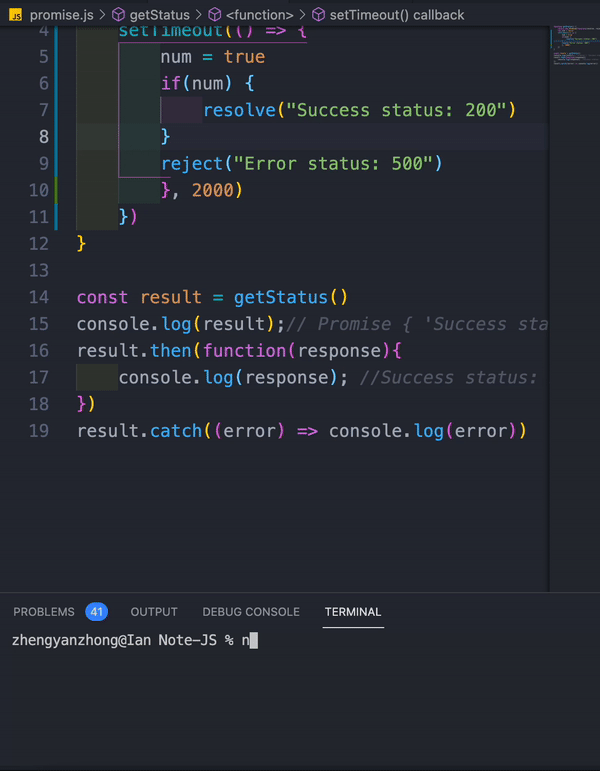

# Javascript note📕

> 首先很感謝大家觀看我筆記,如果有什麼需要修正的請 issue

> 或是 `e-mail` : `ococo09000@gmail.com`

> 同步於"https://hackmd.io/K07_sinJS52I0t4M3gVqQQ"

---

## Table of Contents

- [Declaration](#Declaration)
- [Variables](#Variables)
- [Data Type](#Data-Type)
- [Operators](#Operators)
- [ES6](#ES6)
- [String methods](#String-methods)
- [Array methods](#Array-methods)
- [Object methods](#Object-methods)
- [Scope Chain](#Scope-Chain)
- [Closure](#Closure)
- [Callback](#Callback)
- [Prototype](#Prototype)
- [BOM & DOM](#bom--dom)
- [Web APIs](#web-apis)
- [Regular-Expression](#Regular-Expression)

## Declaration

變數(variable),我們可以稱為儲存資料的盒子

而變數需要被宣告(declare)並且告知編譯器

- 宣告方法
  - var
  - let
  - const

宣告 temp 變數

```javascript
var temp;
```

賦予其數值

```javascript
var temp = 'hello world!!!';
```

> JavaScript 中我們不需要定義變數的資料型態(ex: string...)

---

[⬆️ Back to Contents](#Table-of-Contents)

## Variables

- var
- let
- const

### var

> var 為 JavaScript(ES6)之前唯一的宣告方法

- 可重複宣告
- 可先宣告不給予初始值
- 全域變數

```javascript
var temp;

var temp = 10;

var temp = 100;
console.log(temp); //100
```

### let

let 為 JavaScript(ES6)版本新增的變數宣告方法

考量到 var 會污染到全域變數和造成開發者重複定義變數之情形

現在基本上使用 let 為嚴謹宣告方法

- 區塊變數(block scope)
- 不可重複宣告
- 可宣告不給予初始值

var 造成開發問題

```javascript
var text = 'Hello world';
var text = 'What';
```

```javascript
let text;
let text;
//SyntaxError: Identifier 'text' has already been declared
```

### const

- 不可重複宣告
- 不可修改數值(read only)
- 不可宣告而不給予數值

未給予初始值

```javascript
const text;
//SyntaxError: Missing initializer in const declaration
```

重複宣告其變數

```javascript
const text = '1';
const text = '1';
//SyntaxError: Identifier 'text' has already been declared
```

更改其數值

```javascript
const text = '1';
text = '2';
//TypeError: Assignment to constant variable.
```

以下 sum 方法我們不會再更改其宣告內容

這時候確保 sum 是唯獨(read only)可保持開發流程的品質

```javascript
const sum = (a, b) => {
  return a + b;
};
```

更改陣列內容 為[5,7,3]

```javascript
const array = [2, 5, 7];
array = [5, 7, 3]; //error
```

可以發現 array 被 const 定義唯獨

我們可以使用更改 index 值

```javascript
array[0] = 5;
array[1] = 7;
array[2] = 3;
```

---

[⬆️ Back to Contents](#Table-of-Contents)

## Data Type

- Call by value
  - string
  - number
  - undefined
  - null
  - NaN
- Call by reference
  - array
  - object
  - function

### String

```javascript
var text = String('Hello World');

var text = 'Hello World';
```

#### Single quotes

```javascript
var text = 'Hello World';
```

#### Double quotes

```javascript
var text = 'Hello World';
```

#### Escapes

| syntax | output          |
| ------ | --------------- |
| `\'`   | single quote    |
| `\"`   | double quote    |
| `\\`   | backslash       |
| `\n`   | newline         |
| `\r`   | carriage return |
| `\t `  | tab             |
| `\b`   | word boundary   |
| `\f`   | form feed       |

錯誤示範

```javascript
var text = "Hello world "I am Ian""
```

使用跳脫字元 `\" ` + `\"`

```javascript
var text = 'Hello world "I am Ian".';
```

---

### Number

```javascript
var price = Number(100);

var price = 100;
```

---

### Undefined

未被賦值之變數

```javascript
var value;
console.log(value); //undefined
```

---

### Null

    與undefined差別在於, JavaScrip中變數未給初始值會被賦值undefined

    null類似直接宣告其為空值,類似暫時取代其它值的替代方案

---

### NaN

    NaN(Not a Number),通常非數值而做運算時,即被賦值NaN

```javascript
var value = '我是中文';
const result = value / 100;
console.log(result); // NaN
```

---

### Array

```javascript
var temp = Array(1, 2, 3);

var temp = [1, 2, 3];
```

---

### Object

- `property : value`

```javascript
var user = Object({ name: 'Ian', age: 22 });

var user = {
  name: 'Ian',
  age: 22,
};
```

取得屬性

```javascript
var user = {
  name: 'Ian',
  age: 22,
};

const result = user['name'];
console.log(result); //Ian
```

新增屬性

```javascript
user.email = 'test@gmail.com';

user['email'] = 'test@gmail.com';
```

---

### Function

- declaration function
- expression function
- anonymous expression function
- arrow function (ES6)
- keyWord `return`

```javascript
//declare
function sum(a, b) {
  return a + b;
}
//expression
const sum = function sum(a, b) {
  return a + b;
};
//anonymous expression
const sum = function (a, b) {
  return a + b;
};

// arrow function
const sum = (a, b) => a + b;

const sun = (a, b) => {
  return a + b;
};
```

---

### Return

```javascript
const sum = (a,b) => {
    console.log(a+b)
}
const value = sum(2,2) //print 4
//value equal function


const sum = (a,b) =>  {
    retunr a+b
}

const value = sum(2,2) //4
//value eauql 4
//and
const result = value * value
console.log(result) //16
```

---

[⬆️ Back to Contents](#Table-of-Contents)

## Operators

- [Assignment operator](#assignment-operator)
- [Logic operator](#logic-operator)
- [Arithmetic operators](#arithmetic-operator)

### Assignment operator

| 運算子                      | 描述                           | 例子      | 結果  |
| --------------------------- | ------------------------------ | --------- | ----- |
| (equal) ==                  | 回傳 true or false             | 1 == "1"  | true  |
| (equal) ===                 | 比對是否同資料類型及數值       | 1 === "1" | false |
| (not equal to) !=           | 比對是否不等於數值             | 1 != "1"  | false |
| (not equal to) !==          | 比對是否不等於同資料類型及數值 | 1 !== "1" | true  |
| (more than) >               | 大於                           | 1 > 1     | false |
| (more than equal to) >=     | 大於等於                       | 1 >= 1    | true  |
| (less than) <               | 小於                           | 1 < 1     | false |
| (less than not equal to) <= | 小於等於                       | 1 <= 1    | true  |

---

[⬆️ Back to Opeatators](#operators)

### Logic operator

| 運算子    | 描述                                                          | 例子                  | 結果      |
| --------- | ------------------------------------------------------------- | --------------------- | --------- |
| (and)&&   | 當條件 1 成立便會執行條件 2, 但當條件 1 就不符合,即回傳條件 1 | undefined && true     | undefined |
| (or) \|\| | 任意條件成立便執行,但若都為不成立則執行條件 2                 | NaN \|\| 10           | 10        |
| (not) !   | 反轉該數值                                                    | x = false, !x == true | true      |

---

[⬆️ Back to Opeatators](#operators)

### Arithmetic operator

| 運算子        | 描述         | 例子                 | 結果                |
| ------------- | ------------ | -------------------- | ------------------- | --- |
| (mod) %       | 取餘數       | 10 % 2               | 0                   |
| (increase) ++ | 先賦值再遞增 | x = 10, result = x++ | result = 10, x = 11 |
| ++            | 先遞增再賦值 | x = 10, result = ++x | result = 11, x = 11 |
| (decrease) -- | 先賦值再遞減 | x = 10, result = x-- | result = 10, x = 9  |     |
| --            | 先遞減再賦值 | x = 10, result = --x | result = 9, x = 9   |
| (cube) \* \*  | 該數的立方   | 3 \* \* 5            | 243                 |

---

[⬆️ Back to Opeatators](#operators)[⬆️ Back to Contents](#table-of-contents)

## ES6

JavaScript ECMAScript 2015(ES6) 是非常重要的版本,由於 ES6 解決了之前版本的痛點,促使了 JS 擺脫之前的業障.

- [Class](#class)
- [Modules](#modules)
- [Destructing](#destructing)
- [Parameter](#parameter)
- [Promise](#promise)
- [Fetch](#fetch)
- [Proxy](#proxy)

---

## Class

- 原型的語法糖
- 能狗解決物件導向寫法
- `keywords`
  - class
  - constructor
  - super
  - extends
  - static

```javascript
class User {
  constructor(name, age, sex) {
    this.name = name;
    (this.age = age), (this.sex = sex);
  }

  sayHi() {
    console.log(`Hi, I'm ${this.name} `);
  }
}
```

extends 是繼承類別,而 super 是繼承建構子

```javascript
class User {
  constructor(name, age, sex) {
    this.name = name;
    (this.age = age), (this.sex = sex);
  }
}

class UserCopy extends User {
  constructor(name, age, sex, email) {
    super(name, age, sex);
    this.email = email;
  }
}
```

---

[⬆️ Back to ES6](#es6)

## Modules

在以前 JavaScript 並不需要分割成太多的檔案,前端發展日益蓬勃,全部攪在一起會導致維護困難.

於是 JavaScript 有了多樣化的檔案匯入方式

- Common JS(Node.js)
- ES6 module(官方統一標準)

## Common JS

- `Keywords`
  - `module`
  - `exports`
  - `require`

```javascript
// commonEx.js
module.exports.data = {
  value: 2,
};
module.exports.fuc = function (params) {
  console.log('Hello commonJS');
};

//commonIm.js
const result = require('./commonEx');
console.log(result);
//{ data: { value: 2 }, fuc: [Function (anonymous)] }
```

---

## ES6 Modules

- `keywords`
  - `import`
  - `export`
  - `default`
  - `fileName.mjs`

我們先來看如果在沒有 package 安裝套件的情況下,檔名沒有更改成`.mjs`

```javascript
//esExport.js
const data = {
  value: 2,
};

const sayHi = function () {
  console.log('Hello ES6');
};

export { data, sayHi };

//esImport.js
import { data, sayHi } from './esExport.js';
console.log(data);
//Error: Cannot find module '/Users/zhengyanzhong/Note-JS/modules/esImport.mjs'
```

更改成`.mjs`

```javascript
//esExport.mjs
const data = {
  value: 2,
};

const sayHi = function () {
  console.log('Hello ES6');
};

export { data, sayHi };
//esImport.mjs
import { data, sayHi } from './esExport.mjs';
console.log(data);
//{ value: 2 }
```

如果我們只有匯出一個模組,可以使用`default`設為該檔的預設

```javascript
//esExport.mjs
const data = {
  value: 2,
};
export default data;
```

import 即可不加大括號

```javascript
//esImport.mjs
import data from './esExport.mjs';
console.log(data);
//{ value: 2 }
```

---

[⬆️ Back to ES6](#es6)

## Destructing

- 使用`[ ]`中括號解構陣列
- 使用`{ } `大括號解構物件
- 使用`...`淺複製(shallow copy)

陣列解構

```javascript
const array = ['1', '2', '3'];
const [a, b] = array;
console.log(a, b); // 1, 2
```

陣列使用 shallow copy

```javascript
const array = ['1', '2', '3'];
const [a, ...b] = array;
console.log(a, b); //1, ["2","3"]
```

物件解構

```javascript
const object = {
  name: 'Ian',
  age: 23,
};
const { name, age } = object;
console.log(name, age); // Ian, 23
```

物件使用 shallow copy

```javascript
const object = {
  name: 'Ian',
  age: 23,
  email: 'test@gmail.com',
};
const { name, ...age } = object;
console.log(name, age); // Ian, { age: 23, email: 'test@gmail.com' }
```

---

[⬆️ Back to ES6](#es6)

## Parameter

```javascript
function sayHi(...args) {
  console.log(args);
  //[ 'Ian', 22, 'test@gmail.com' ]
  args.forEach((item, index) => console.log(index + 1 + '.', item));
}
sayHi('Ian', 22, 'test@gmail.com');
/*
1. Ian
2. 22
3. test@gmail.com
*/
```

---

[⬆️ Back to ES6](#es6)

## Promise

- 解決使用 callback 難易閱讀
- status
  - pedding
  - fulfill
  - reject
- `then`、`catch` 抓回回傳的 promise
- method
  - Promise.all([Promise array])

```javascript
function getStatus() {
  return new Promise(function (resolve, reject) {
    let num = true;
    if (num) {
      resolve('Success status: 200');
    }
    reject('Error status: 500');
  });
}

const result = getStatus();
console.log(result); // Promise { 'Success status: 200' }
result.then(function (response) {
  console.log(response); //Success status: 200
});
result.catch((error) => console.log(error));
```

我們使用`setTimeout`來演練抓取後端資料時 pedding 的狀態

```javascript
function getStatus() {
  return new Promise(function (resolve, reject) {
    let num = false;
    setTimeout(() => {
      num = true;
      if (num) {
        resolve('Success status: 200');
      }
      reject('Error status: 500');
    }, 2000);
  });
}

const result = getStatus();
console.log(result); // Promise { 'Success status: 200' }
result.then(function (response) {
  console.log(response); //Success status: 200
});
result.catch((error) => console.log(error));
```

## 

[⬆️ Back to ES6](#es6)

## Fetch

```javascript
// Example POST method implementation:
async function postData(url = '', data = {}) {
  // Default options are marked with *
  const response = await fetch(url, {
    method: 'POST', // *GET, POST, PUT, DELETE, etc.
    mode: 'cors', // no-cors, *cors, same-origin
    cache: 'no-cache', // *default, no-cache, reload, force-cache, only-if-cached
    credentials: 'same-origin', // include, *same-origin, omit
    headers: {
      'Content-Type': 'application/json',
      // 'Content-Type': 'application/x-www-form-urlencoded',
    },
    redirect: 'follow', // manual, *follow, error
    referrerPolicy: 'no-referrer', // no-referrer, *no-referrer-when-downgrade, origin, origin-when-cross-origin, same-origin, strict-origin, strict-origin-when-cross-origin, unsafe-url
    body: JSON.stringify(data), // body data type must match "Content-Type" header
  });
  return response.json(); // parses JSON response into native JavaScript objects
}

postData('https://example.com/answer', { answer: 42 }).then((data) => {
  console.log(data); // JSON data parsed by `data.json()` call
});
```

實際使用 mongoose 演練一下

```javascript
async function register(event) {
  event.preventDefault();
  await fetch('http://localhost:3001/register', {
    headers: {
      'Content-Type': 'application/json',
    },
    method: 'POST',
    body: JSON.stringify({
      userName: user.userName,
      passWord: user.passWord,
      email: user.email,
      country: user.country,
    }),
  });
  alert('successful');
  setUser({
    ...user,
    userName: '',
    passWord: '',
    email: '',
    country: 'Taiwan',
  });
  router('/user/signin');
}
```

---

[⬆️ Back to ES6](#es6)

## Proxy

proxy 是 ES6 新增的代理方式

```javascript
new Proxy(target, handler);
```

[handler methods](https://developer.mozilla.org/zh-TW/docs/Web/JavaScript/Reference/Global_Objects/Proxy)

```javascript
const object = { name: 'Dennis' };
const copyA = new Proxy(object, {
  get: (obj, prop) => console.log(obj, prop),
});
copyA.name; //{ name: 'Dennis' } name
```

我們使用 proxy 來建立一個例子,透過 copyA 去代理 object 執行相關動作

```javascript
const object = { name: 'Dennis' };
const copyA = new Proxy(object, {
  get: (obj, property) => {
    return property in obj ? obj[property] : 'null';
  },
});
console.log(copyA.user, copyA.name); // null Dennis
```

proxy 代理更改 object 數值

```javascript
const object = { name: 'Dennis' };
const copyA = new Proxy(object, {
  get: (obj, property) => {
    return property in obj ? obj[property] : 'null';
  },
  set: (object, property, value) => {
    return (object[property] = value);
  },
});
console.log(copyA.user, copyA.name); // null Dennis
copyA.user = 3;
console.log(copyA.user, copyA.name); // 3 Dennis
copyA.name = 'IAN';
console.log(copyA.user, copyA.name); // 3 IAN
```

---

[⬆️ Back to ES6](#es6) [⬆️ Back to Contents Tables](#table-of-contents)

## String methods

- includes
- slice(start, end)
- substring(start, end)
- substr(start, length)
- replace

### includes

```javascript
const string = 'abcde';
console.log(string.toLowerCase().includes('a')); //true
```

### slice

```javascript
var text = 'Hello world';
console.log(text.slice(0, 3)); //Hel
```

### substring

```javascript
var text = 'Hello world';
console.log(text.substring(3, 8)); //lo wo
```

### substr

```javascript
var text = 'Hello world';
console.log(text.substr(3, 4)); //lo wo
```

### replace

```javascript
var text = '台灣新北市中和區';
var concat = text.replace('台灣', '中華民國');
console.log(concat); // 中華民國新北市中和區
```

### toLowerCase

```javascript
var text = 'Hello World';
console.log(text.toLowerCase()); //hello world
```

### toUpperCase

```javascript
var text = 'Hello World';
console.log(text.toUpperCase()); //HELLO WORLD
```

### split

```javascript
var text = 'Hello%World';
console.log(text.split('%')); //[ 'Hello', 'World' ]
```

### indexOf

```javascript
var text = 'Hello World';
console.log(text.indexOf('o')); //4
```

---

[⬆️ Back to String](#string-methods) [⬆️ Back to Contents](#Table-of-Contents)

## Array methods

- toString
- pop
- push
- shift
- unshift
- filter
- map
- length
- concat
- splice
- slice
- every
- some
- foreach

### toString

```javascript
var temp = [1, 2, 3, 4, 5, 6, 7, 8];
console.log(temp.toString()); //1,2,3,4,5,6,7,8
```

### concat

```javascript
var a = [1, 2, 3, 4, 5, 6, 7, 8];
var b = [10, 12];
console.log(a.concat(b));
//[1, 2, 3,  4, 5, 6, 7, 8, 10, 12]
```

### length

```javascript
var a = [1, 2, 3, 4, 5, 6, 7, 8];
console.log(a.length); //8
```

### pop

```javascript
var a = [1, 2, 3, 4, 5, 6, 7, 8];
a.pop();
console.log(a);
/*
[
  1, 2, 3, 4,
  5, 6, 7
]
*/
```

### push

```javascript
var a = [1, 2, 3, 4, 5, 6, 7, 8];
a.push(9);
console.log(a);
/*
[
  1, 2, 3, 4,
  5, 6, 7, 8 , 9
]
*/
```

### shift

```javascript
var a = [1, 2, 3, 4, 5, 6, 7, 8];
a.shift();
console.log(a);
/*
[
  2, 3, 4, 5,
  6, 7, 8
]
*/
```

### unshift

```javascript
var a = [1, 2, 3, 4, 5, 6, 7, 8];
a.unshift(9);
console.log(a);
/*
[
  9, 1, 2, 3, 4,
  5, 6, 7, 8
]
*/
```

### map

```javascript
var a = [1, 2, 3, 4, 5, 6, 7, 8];
console.log(
  a.map(function (item) {
    return item * 2;
  })
);
/*[
   2,  4,  6,  8,
  10, 12, 14, 16
]
*/
```

### filter

```javascript
var a = [1, 2, 3, 4, 5, 6, 7, 8];
console.log(
  a.filter(function (item) {
    return item > 2;
  })
);
//[ 3, 4, 5, 6, 7, 8 ]
```

### some

```javascript
var a = [1, 2, 3, 4, 5, 6, 7, 8];
console.log(
  a.some(function (item) {
    return item > 2;
  })
);
//true
```

### every

```javascript
var a = [1, 2, 3, 4, 5, 6, 7, 8];
console.log(
  a.every(function (item) {
    return item > 2;
  })
);
//false
```

### forEach

```javascript
var a = [1, 2, 3, 4, 5, 6, 7, 8];
console.log(
  a.forEach(function (item) {
    console.log(item);
  })
);
/*
1
2
3
4
5
6
7
8
*/
```

---

[⬆️ Back to Array methods](#array-methods) [⬆️ Back to Contents](#Table-of-Contents)

## Object methods

- hasOwnProperty
- freeze

### freeze

freeze 可以達成 const 的唯獨效果,避免物件被更改屬性值

```javascript
function freezeObj() {
  const MATH_CONSTANTS = {
    PI: 3.14,
  };
  // Only change code below this line
  Object.freeze(MATH_CONSTANTS);

  // Only change code above this line
  try {
    MATH_CONSTANTS.PI = 99;
  } catch (ex) {
    console.log(ex);
  }
  return MATH_CONSTANTS.PI;
}
const PI = freezeObj(); //3.14
```

### hasOwnProperty

```javascript
const user = {
  name: 'Ian',
  age: 22,
};
const checkResult = user.hasOwnProperty('name');
console.log(checkResult); //true
```

---

[⬆️ Back to Contents](#Table-of-Contents)

## Scope Chain

Scope 其實就是定義一個區塊,只能內層存取,也可以稱為最小暴露原則

- 優勢
  - 減少命名衝突
  - 達到暴露最少原則
  - 避免污染全域變數
- 區塊範圍
  - `function scope`
  - `block scope`
  - `global`
- scope chain
  - 呼叫之變數、函式在哪個作用域

`函式管理`

```javascript
function scope() {
  let str = 'Hello world!';
  console.log(str);
}

scope(); // Hello World
console.log(str); // undefined
```

`模組化管理`

```javascript
let sayModule = {
  sayHello: function (str) {
    console.log(str);
  },
  sayGoodbye: function (str) {
    console.log(str);
  },
};
sayModule.sayHello(1);
```

`迴圈`

```javascript
console.log(`globla a: ${a}`); //undefined
for (var a = 0; a < 10; a++) {
  setTimeout(() => {
    console.log(a);
    //10
    //10
    //10...
  }, 2000);
}
console.log(a); //10
```

我們可以發現其實迴圈並沒有自己的 block

導致 a 直接污染 global,最後非同步函式只會抓到最後 stack(堆疊好的)
`var a = 10 a < 10 `再依序執行就是每次都抓到 10 的數值

而解法我們可以使用

- `let`
- `IIFE(Immediately invoked function expression)`

```javascript
for (let a = 0; a < 10; a++) {
  setTimeout(() => {
    console.log(a);
  }, 1000);
  //1
  //2
  //3...
}
```

最後我們要來解釋 `scope chain`

- `呼叫之變數、函式在哪個作用域`

```javascript
var name = 'Ian';
a(); //Ian

function a() {
  var name = 'Dennis';
  b();
}
function b() {
  console.log(name);
}
```

我們可以發現因為 function b 被定義在 global,於是自然而然無論在何處呼叫,取得的變數都是 global name

---

[⬆️ Back to Contents](#Table-of-Contents)

## Closure

- 使用指向另一個 function 之方式傳遞
- 避免被垃圾回收機制回收,達到繼續存取指向變數
- 最小曝露原則

首先我們先看下面的例子

```javascript
var count = 0;
function counter() {
  count += 1;
  console.log(count);
}

counter(); //1
counter(); //2
```

這樣做的壞處在於只要全域變數中有一樣的 count,就會造成命名衝突.

接著我們把 function 當作回傳值

- countFn 會接住 counter()
- counterFn 就會指向裡面的 anonymous function

```javascript
function counter() {
  var count = 0;
  //建立私有變數
  return function (x) {
    //利用return 把function傳出去
    count += x;
    return count;
    //最後再把值回傳
  };
}

const countFn = counter();
const result = countFn(5);
console.log(result);
```

當然你也可以定義好函式再回傳

```javascript
function counter() {
  var count = 0;
  //建立私有變數
  function inner(x) {
    count += x;
    return count;
    //最後再把值回傳
  }
  return inner;
  //利用return 把function傳出去
}

const countFn = counter();
const result = countFn(5);
console.log(result);
```

---

[⬆️ Back to Contents](#Table-of-Contents)

## Callback

由於 JavaScript 是使用者響應語言

常常實作時,我們需要監聽使用者是否點擊按鈕

而點擊按鈕響應的事件就是使用 callback 執行

- 回調之參數
- 解決 step by step

```javascript
function buttonEvent(callback) {
  callback();
}
```

下列的示範我們可以更了解

我要先執行

1. wash hands
2. eat dinner
3. studying

```javascript
function todo(callback) {
  console.log('studying');
  callback;
}

function eat(callback) {
  console.log('eat dinner');
  callback;
}

function study() {
  console.log('wash hands');
}

todo(eat(study()));
/*
studying
eat dinner
wash hands
*/
```

如何使用 callback 取得資料

```javascript
function buttonEvent(callback) {
  let result = 2;
  callback(result);
}

const getData = (data) => {
  let value = data;
  console.log('value is: ' + value);
};

buttonEvent(getData);
```

我們來小實踐平常一些 API 的 callback

我們要來寫個自己開發的小功能

- data 接受三個參數 (number, array , callback)
- callback 可以取得完成後的陣列,跟原始陣列

```javascript
function data(num, arr, callback) {
  let copyArr = [...arr];
  arr.push(num);
  callback(arr, copyArr);
}

function getData(data, oldData) {
  console.log(`data: ${data}, the oldData ${oldData}`);
}
let number = 100;
let array = [1, 2, 3];
data(number, array, getData);
//data: 1,2,3,100 , the oldData: 1,2,3
```

如果我們只想取得最新的陣列就好,原始陣列不需要取得

也就是 callback 只需要一個參數取得即可

```javascript
function data(num, arr, callback) {
  let result = [...arr]; //shallow copy array
  arr.push(num);
  callback(result, arr);
}

function getData(data) {
  console.log(`data: ${data}`);
}
let number = 100;
let array = [1, 2, 3];
data(number, array, getData);
// data: 1,2,3
```

---

[⬆️ Back to Contents](#Table-of-Contents)

## Prototype

JavaScript 中有所謂的建構函數和 prototype(原型)達成類似 class 的效果

- `prototype`
- `__proto__`

我們先建立一個 User 的 constructor function

```javascript
function User(name, age) {
  this.name = name;
  this.age = age;
}

const user = new User('Ian', 22);
```

目前 User 本身沒有 method 可以使用

我們使用 prototype 給予 method

```javascript
User.prototype.sayHI = function () {
  console.log(`My name is ${this.name} `);
};

user.sayHI(); //My name is Ian
```

把 user 打印出來可以發現 prototype 指向我們所`參考`的物件


### `prototype chain`

我們可以使用`__proto__`

```javascript
function User(name, age) {
  this.name = name;
  this.age = age;
}

const user = new User('Ian', 22);

User.prototype.sayHI = function () {
  console.log(`My name is ${this.name} `);
};

user.sayHI(); //My name is Ian
console.log(user.__proto__ === User.prototype); //true
```


---

[⬆️ Back to Contents](#Table-of-Contents)

## BOM & DOM

BOM(Browser Object Model)也就是所謂的瀏覽器視窗

properties:

- screen.width
- screen.height
- screen.availWidth
- screen.availHeight
- screen.colorDepth
- screen.pixelDepth

DOM(Document Object Model)是掌管 HTML element 的物件

而 DOM 是依據 W3C 所定義,每個 HTML element 都是節點

可以看到 html 是 head 和 body 的父節點

```html
<!DOCTYPE html>
<html lang="en">
  <head>
    <meta charset="UTF-8" />
    <meta http-equiv="X-UA-Compatible" content="IE=edge" />
    <meta name="viewport" content="width=device-width, initial-scale=1.0" />
    <title>Document</title>
  </head>
  <body>
    <div id="root">add</div>
    <script src="./let.js"></script>
  </body>
</html>
```

---

[⬆️ Back to Contents](#Table-of-Contents)

## Web APIs

---

[⬆️ Back to Contents](#Table-of-Contents)

## Regular Expression

### test

- return `true` 、`false`

```javascript
let words = 'Hello I am Ian';
let keyword = /I/;
let result = keyword.test(words);
console.log(result); //true
```

### match

- return `array`

```javascript
let extractStr = "Extract the word 'coding' from this string.";
let codingRegex = /coding/;
let result = extractStr.match(codingRegex);
console.log(result);
/*
[
  'coding',
  index: 18,
  input: "Extract the word 'coding' from this string.",
  groups: undefined
]
*/
```

### tags

- `|` or
- `i` 不分大小寫
- `g` 全局搜索
- `[range]` 特定範圍
- `^` 檢查字首
- `*` 匹配前個重複字元多次
- `?`

use `|`

```javascript
let words = 'apple banana guava';
let keyword = /cat|apple/;
let result = keyword.test(words);
console.log(result); //true
```

use `i`

我們可以看到正則表達式確實回報錯誤

```javascript
let words = 'Apple';
let keyword = /apple/;
let result = keyword.test(words);
console.log(result); //false
```

但如果今天我要確認使用者有這個單字,不論大、小寫

```javascript
let words = 'Apple';
let keyword = /apple/i;
let result = keyword.test(words);
console.log(result); //true
```

use `[range]`

```javascript
let quoteSample = 'Blueberry 3.141592653s are delicious.';
let myRegex = /[h-s2-6]/gi;
let result = quoteSample.match(myRegex);
/*
[ 'l',
  'r',
  'r',
  '3',
  '4',
  '5',
  '2',
  '6',
  '5',
  '3',
  's',
  'r',
  'l',
  'i',
  'i',
  'o',
  's' ]
  */
```

`^` 檢查字首

```javascript
let quoteSample = '3 blind mice.';
let myRegex = /[^aeiou^0-9]/gi;
let result = quoteSample.match(myRegex);
console.log(result);
//[ ' ', 'b', 'l', 'n', 'd', ' ', 'm', 'c', '.' ]
```

`*`

```javascript
const str = 'Booooooooooo Booo boooooo';
const reg = /Bo*/gi;
result = str.match(reg);
console.log(result);
//[ 'Booooooooooo', 'Booo', 'boooooo' ]
```

`?`

```javascript
const str = 'Booooooooooo Booo boooooo';
const reg = /Bo?/gi;
result = str.match(reg);
console.log(result);
//[ 'Bo', 'Bo', 'bo' ]
```

---

[⬆️ Back to Contents](#Table-of-Contents)
